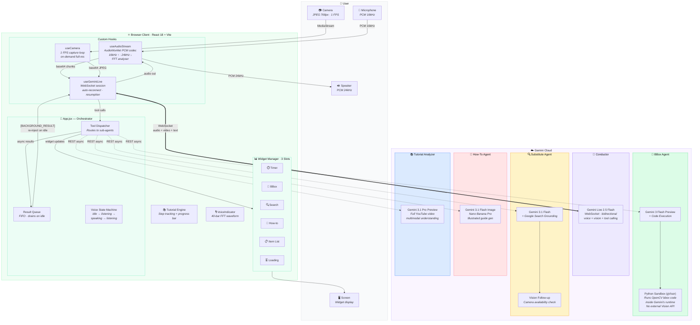
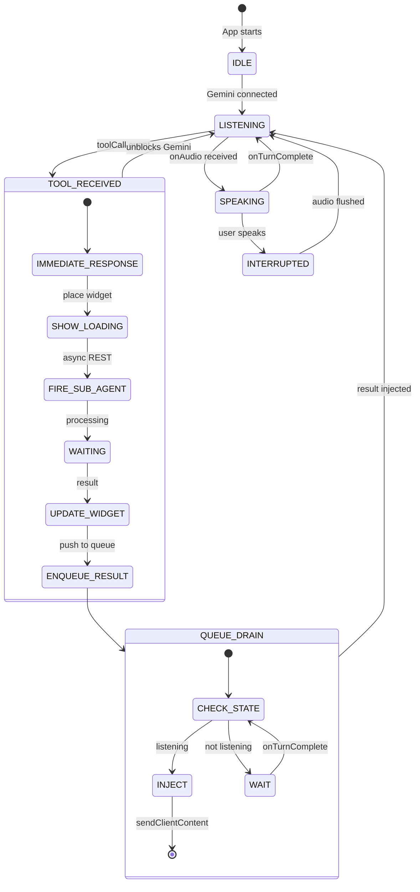
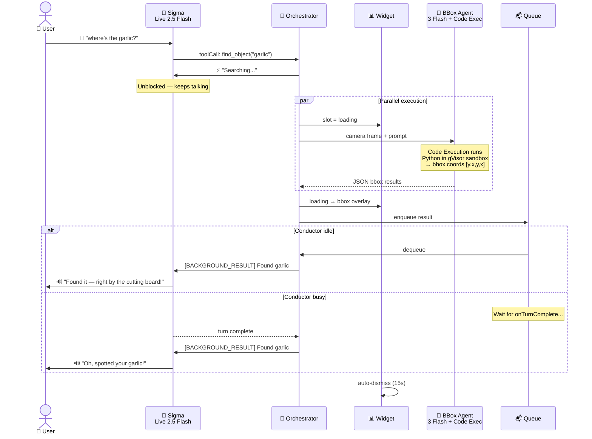
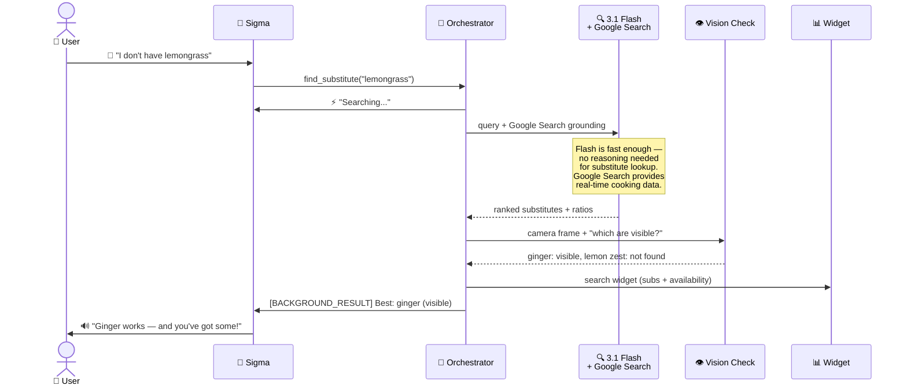
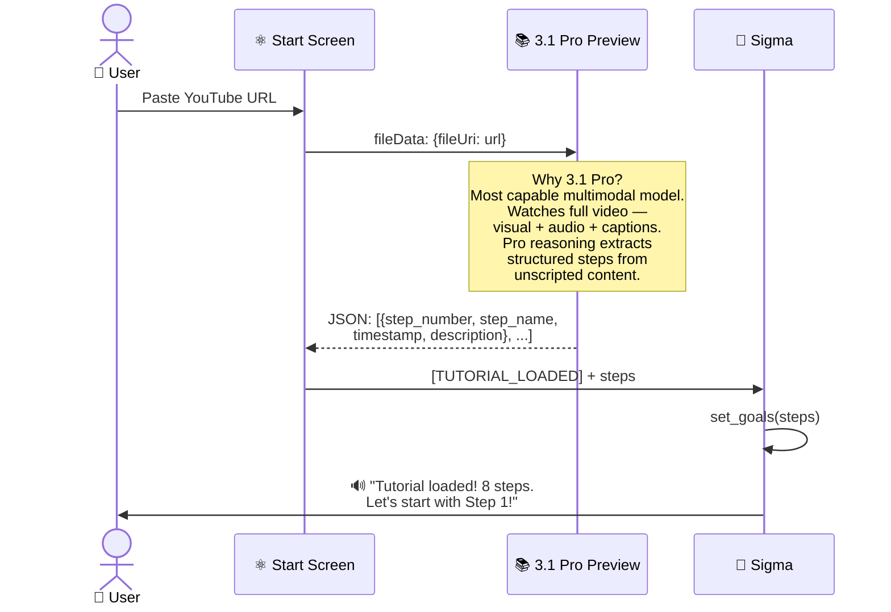
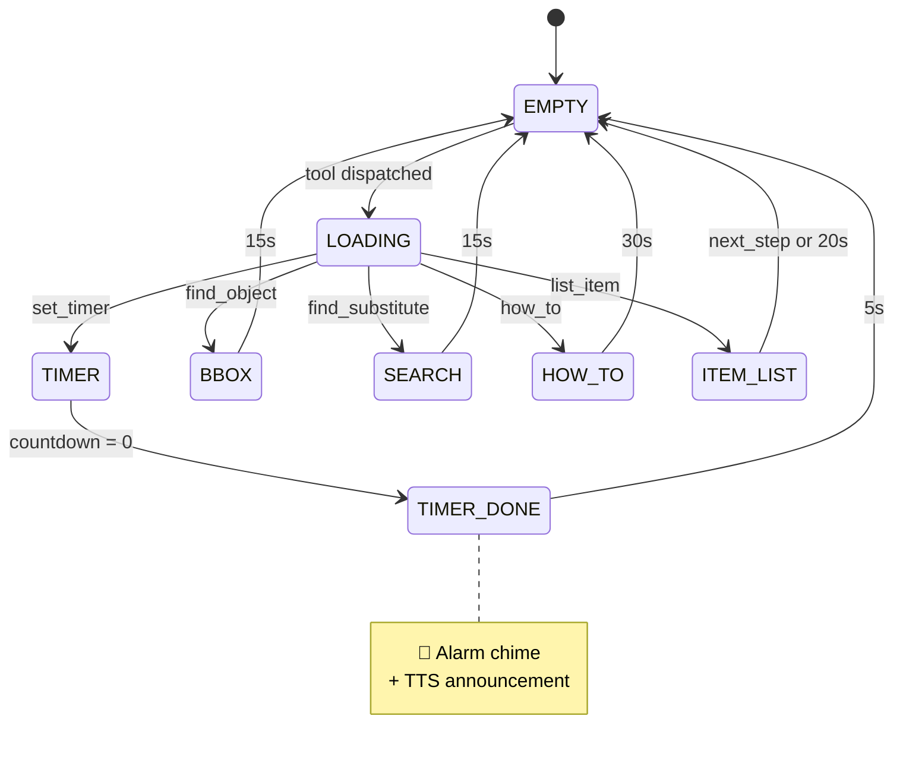

# Sigma — Hands-Free AI Cooking Companion

> **Gemini Live Agent Challenge — Live Agents Category**

[](https://geminiliveagentchallenge.devpost.com)
[](https://ai.google.dev)
[](https://cloud.google.com)
[](https://react.dev)

---

#GeminiLiveAgentChallenge

## What is Sigma?

A real-time, multimodal AI cooking assistant that lives in your browser. Your hands are covered in flour — you can't type. Your eyes are on the pan — you can't read a recipe. Sigma listens, watches, and responds with **voice + vision**, no screen touching required.

Now unlocked to guide through any YouTube tutorial.

**This is not a chatbot. There is no text box. Sigma is entirely hands-free.**

---

## Demo

> 📹 [Watch the 3-minute demo](<!-- add video link here -->)

---

## Why This Is Different

| Traditional Cooking App | Sigma |
|---|---|
| You type a question | You say it aloud |
| You read the answer | Sigma speaks back |
| You tap "next step" | You say "next" |
| Static recipe page | Live camera awareness |
| Single model | 6 Gemini models orchestrated in parallel |

---

## Features

### Voice + Vision
- Bidirectional audio via Gemini Live API — 16kHz PCM in, 24kHz out via AudioWorklet
- Barge-in detection, session resumption, real-time transcription
- 1 FPS camera feed streamed to Gemini for continuous kitchen awareness

### 8 Agentic Tools

| Tool | Trigger | What Happens |
|---|---|---|
| `set_timer` | "set a 5 minute timer" | Countdown widget |
| `find_object` | "where's the garlic?" | Camera → bbox detection → overlay |
| `find_substitute` | "I'm out of lemongrass" | Google Search grounding + camera check |
| `how_to` | "how do I dice an onion?" | Illustrated 4-step guide generated |
| `list_item` | "what do I need?" | Ingredient/tool list widget |
| `set_goals` | YouTube tutorial loaded | Steps parsed into progress tracker |
| `check_current_step` / `check_next_step` | "what step am I on?" | Returns tutorial state |
| `next_step` | "I'm done with this" | Advances tutorial index |

### Tutorial Mode
Paste a YouTube URL → Gemini 3.1 Pro watches the full video → extracts structured steps → navigate hands-free with voice.

---

## 🏗️ Architecture

> **Zero-backend** — all orchestration runs client-side. No server, no database.

### System overview



### Why each model?

| Model | Role | Why this one? |
|---|---|---|
| **Gemini Live 2.5 Flash** | Conductor — voice conversation + tool calling | Native audio WebSocket, lowest latency, built-in session resumption |
| **Gemini 3 Flash Preview** | Bounding box detection | **Code Execution** — runs Python/OpenCV in Gemini's own gVisor sandbox to compute bbox coords. No external Vision API needed. Simple model is enough for object detection |
| **Gemini 3.1 Flash** | Substitute finder | **Google Search Grounding** — real-time web data for cooking substitutes. Flash is fast enough — no deep reasoning needed for "what replaces X?" |
| **Gemini 3.1 Flash Image** | How-to illustrated guides | **Nano Banana Pro** — native image gen with legible text, preserves camera frame assets as reference |
| **Gemini 3.1 Pro Preview** | YouTube tutorial analysis | **Most capable multimodal model** — watches full video (visual + audio + captions), extracts structured steps. Pro-level reasoning needed for unstructured tutorial content |
| **Gemini 2.5 Flash TTS** | Timer announcements | Dedicated TTS endpoint — bypasses live session so timers fire even mid-conversation |

### Voice state machine



### Tool dispatch flow



### Substitute search — Google Search grounding



### Tutorial analysis — Gemini 3.1 Pro



### Widget slot lifecycle



---

## Key Design Decisions

| Decision | Why |
|---|---|
| **Zero backend** | All API calls from browser — no server, no infra cost |
| **Fire-and-forget tools** | Immediate placeholder unblocks voice — no silence |
| **Code execution for bbox** | Python runs inside Gemini's sandbox — no external Vision API |
| **Google Search grounding** | Real-time web data — recipes change, training data doesn't |
| **3.1 Flash for substitutes** | Fast enough — "what replaces X" doesn't need reasoning |
| **3.1 Pro for tutorials** | Only model that watches full YouTube video multimodally |
| **Separate TTS agent** | Timer announcements fire even mid-conversation |
| **Result injection queue** | Sub-agent results wait for idle — no mid-sentence interrupts |
| **3-slot widget system** | `empty → loading → result → auto-dismiss` lifecycle |

---

## Project Structure

```
sigma/
├── frontend/
│   ├── src/
│   │   ├── App.jsx                     # Orchestrator + tool dispatch
│   │   ├── hooks/
│   │   │   ├── useGeminiLive.js        # Gemini Live WebSocket client
│   │   │   ├── useCamera.js            # Camera stream + frame capture
│   │   │   └── useAudioStream.js       # PCM audio I/O via AudioWorklet
│   │   └── components/
│   │       ├── CameraWidget.jsx        # Live feed + flash animation
│   │       ├── TimerWidget.jsx         # Countdown + drain bar
│   │       ├── BBoxWidget.jsx          # Bounding box overlay
│   │       ├── SearchWidget.jsx        # Substitute display
│   │       ├── HowToWidget.jsx         # Illustrated guide
│   │       ├── VoiceIndicator.jsx      # FFT waveform canvas
│   │       └── TutorialProgressBar.jsx
│   ├── public/
│   │   ├── pcm-recorder-processor.js   # AudioWorklet: mic → 16kHz PCM
│   │   └── pcm-player-processor.js     # AudioWorklet: 24kHz PCM → speaker
│   └── .env                            # VITE_GEMINI_API_KEY
└── README.md
```

---

## Getting Started

```bash
cd frontend
npm install
```

Create `frontend/.env`:
```
VITE_GEMINI_API_KEY=your_google_ai_studio_key_here
```

```bash
npm run dev
```

Open `http://localhost:5173`, grant mic + camera, start talking.

For **Tutorial Mode**: paste a YouTube URL on the splash screen before starting.

---

## Tech Stack

| Layer | Technology |
|---|---|
| Frontend | React 18 + Vite 5 |
| Styling | Tailwind CSS 3.4 |
| Animation | Framer Motion 12 |
| Gemini SDK | @google/genai 1.45 |
| Audio | Web Audio API + AudioWorklet |

---

## What I Learned

**Background tasks + result injection is the key pattern.** Respond immediately, run heavy tasks async, inject results as `[BACKGROUND_RESULT]` on the next idle turn. Conversation never blocks.

**Context window compression matters.** Long cooking sessions accumulate context. `SlidingWindow` compression prevents degradation over 30-60 minute sessions.

**Multi-model orchestration needs clear handoffs.** Each model returns different formats. A clean dispatch layer with a FIFO result queue prevents race conditions.

---

## License

MIT
